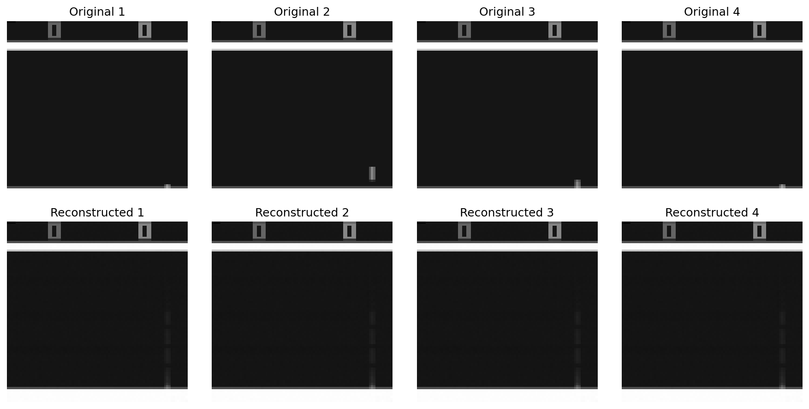
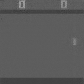
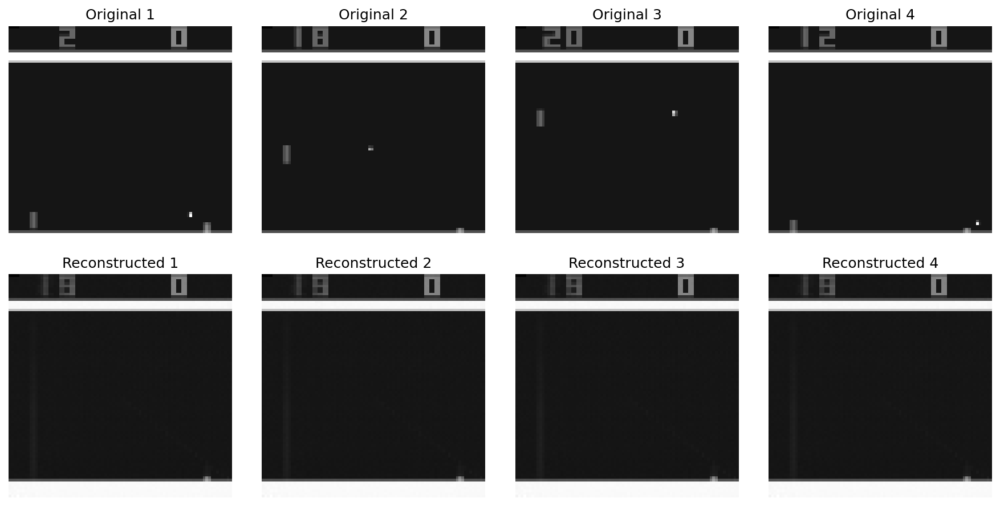
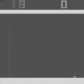
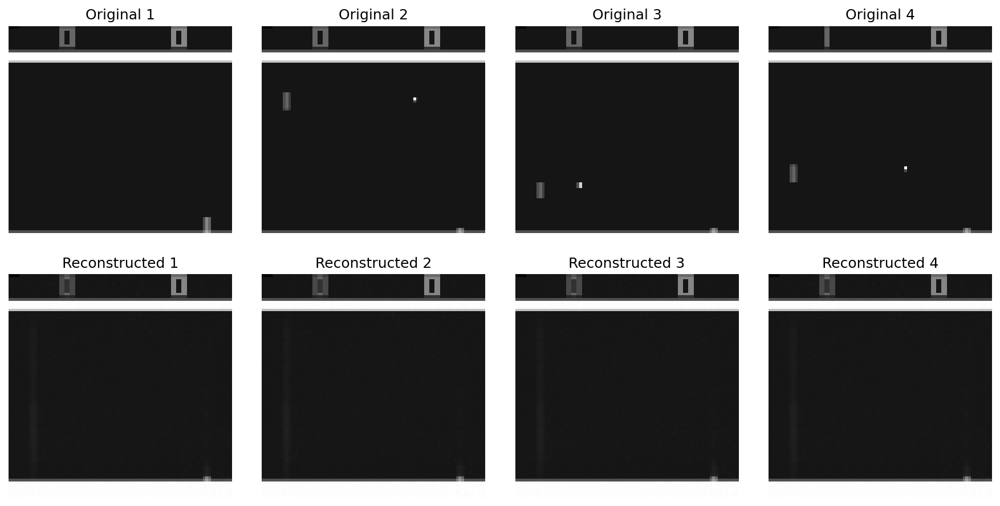

# Neural-Atari Minimal: Fast Pong World Model

Minimal fork of Paras Chopra's Neural-Atari for rapid prototyping. Trains and samples a Pong world model in minutes on M3 Pro or 5090.

---

## Quick Start

```bash
uv pip install -r requirements.txt
python train_models.py
python interactive_pong_world.py
```

---

## Visual Outputs & Scaling

| Steps | Type         | Output                                    | Scaling Note                  |
|-------|--------------|-------------------------------------------|-------------------------------|
| 100   | Recon        |  | AE learns paddle/ball, blurry |
| 100   | Rollout      |    | Short horizon, unstable       |
| 500   | Recon        |      | Good structure, minor blur    |
| 500   | Rollout      |        | Physics, short-term stable    |
| 10k   | Recon        |  | Near-perfect, sharp           |
| 10k   | Rollout      |    | Long horizon, robust          |

---

## Architecture

- **Autoencoder**: 84x84 grayscale → 128D latent → 84x84 recon
- **Predictor**: MLP, latent_t → latent_t+1
- **Data**: D4RL Pong, 84x84, grayscale
- **Training**: 500–10k steps, batch 64, MSE loss
- **Device**: GPU (CUDA/MPS/CPU auto)

---

## Scaling Laws

- **Data**: 10k–100k frames = better generalization, slower overfit
- **Steps**: 50k steps = basic physics, ??? = near-perfect
- **Latent dim**: 128D is enough for Pong; higher = slower, no gain
- **Batch**: 64 is sweet spot for speed/quality
- **Model**: Deeper AE = slower, no gain for Pong

---

## Performance

10k frames
- 500 steps: <4 min on M3 Pro, <1 min on 5090
- Final recon loss: ~0.0003
- Final pred loss: ~0.0000
- 200-frame rollout: stable, aprox realistic

---

## File Structure

- `train_models.py` — Fast train script
- `interactive_pong_world.py` — Interactive rollout UI
- `play_pong_human.py` — Human data collection
- `collect_pong_trajectories.py` — DQN data collection
- `world_model.py` — AE + predictor
- `latent_action_model.py` — VQ-VAE/latent action
- `assets/` — Outputs
- `train.ipynb` — Full training + plots

---

## References

- DreamerV3, GameGAN, VideoGPT, MuZero, PlaNet

---

## Notes

- No yap. Pure speed. For research iteration.
- Use `torch.compile` and MPS/CPU fallback.
- All outputs in `assets/`. No external logging by default.

---

*Built for rapid iteration. Scale thoughtfully.*
